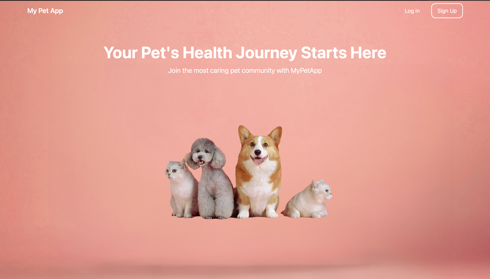
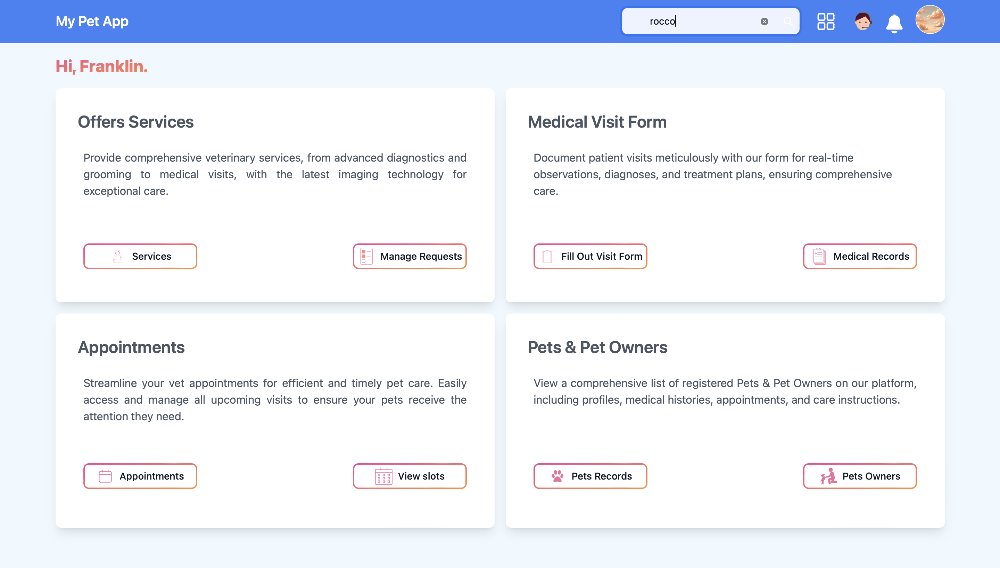
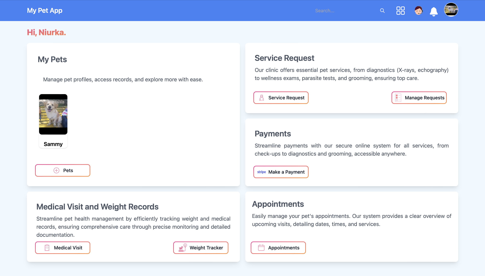
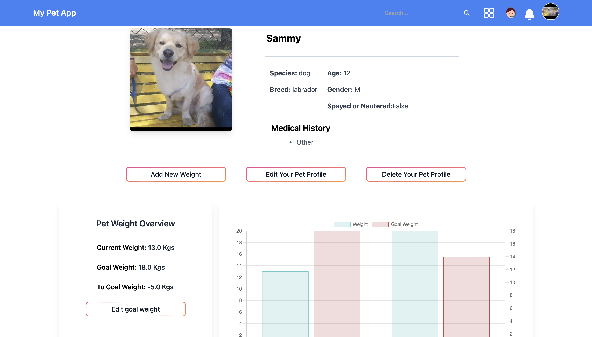
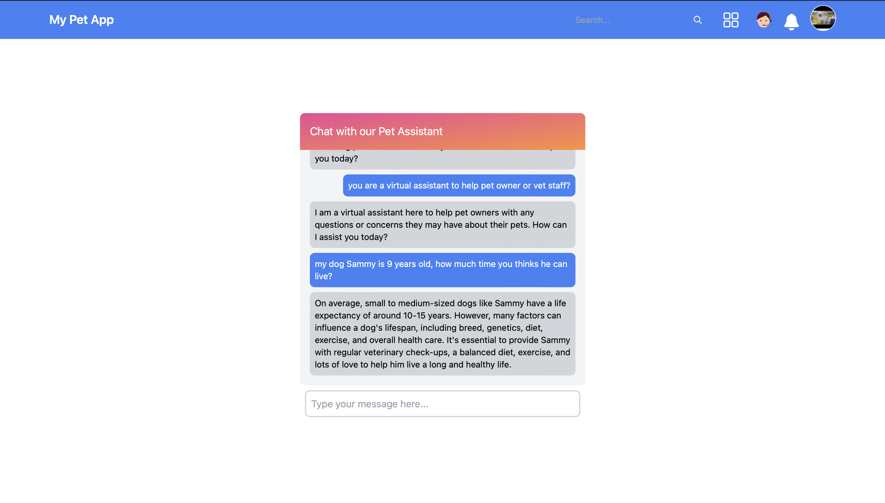
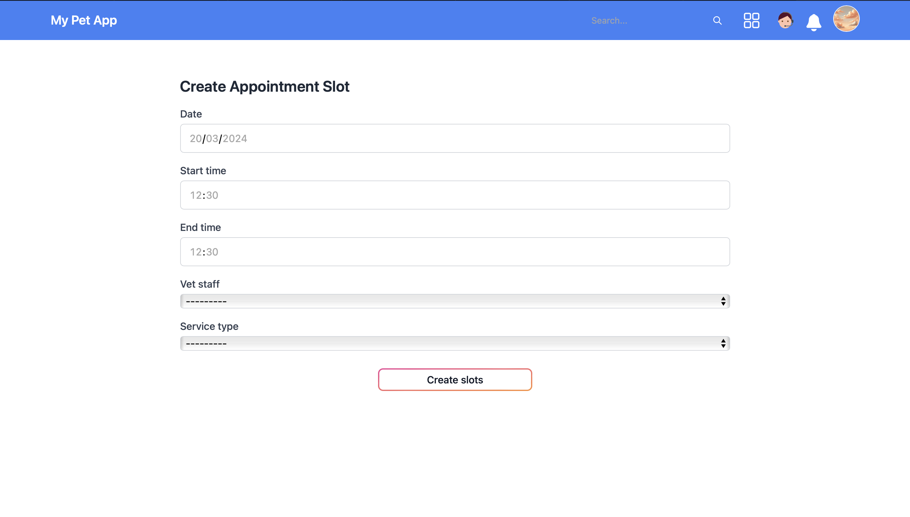

## Veterinary Medical Center Application

### Overview
This application is a comprehensive solution designed for veterinary medical centers to facilitate and streamline the interaction between pet owners and veterinary staff. Developed using Django for the backend, Tailwind CSS and JavaScript for the frontend, and supported by SQLite and PostgreSQL for database management, it offers a user-friendly platform for managing pet healthcare services.

### Features

#### For Veterinary Staff
- **Service Management:** Create and manage categories and services offered to pet owners, such as diagnostics, medical visits, grooming, etc.
- **Appointment Scheduling:** Generate available slots for appointments, allowing pet owners to book visits conveniently.
- **Medical Records Management:** Input and store detailed information from each medical visit, accessible to pet owners immediately.
- **Dashboard:** A comprehensive view of service requests and their statuses, enabling efficient management and updates.

#### For Pet Owners
- **Service Booking:** Easy booking of appointments for various services offered by the veterinary center.
- **Medical Record Access:** Immediate access to their pet's medical visit records, enhancing transparency and trust.
- **Weight Tracking:** Monitor and track their pet's weight over time, with visual charts for better understanding.
- **Online Payments:** Secure payment integration through Stripe for hassle-free transactions.

#### Shared Features
- **Virtual Assistant:** Both vet staff and pet owners benefit from a virtual assistant available on their dashboards, designed to help resolve common issues and queries.
- **Responsive Design:** The application is in its first version, with ongoing efforts to enhance responsiveness and user experience across various devices.

### Technical Stack
- **Backend:** Django
- **Frontend:** Tailwind CSS, JavaScript
- **Database:** SQLite, PostgreSQL 16
- **Payments:** Stripe

  
  
  
  
  
  
